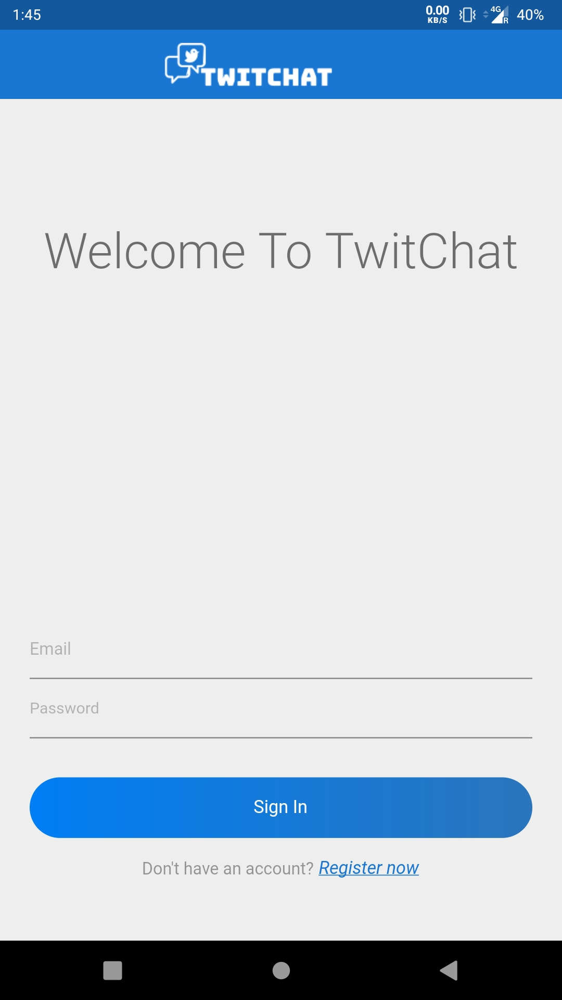
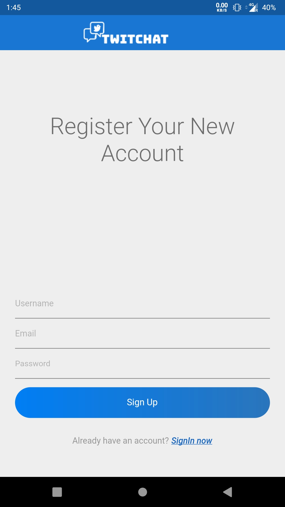
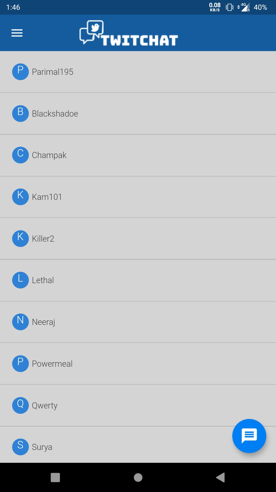
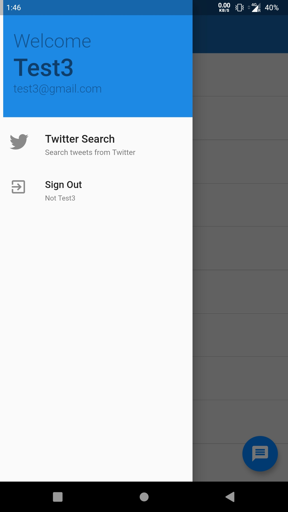
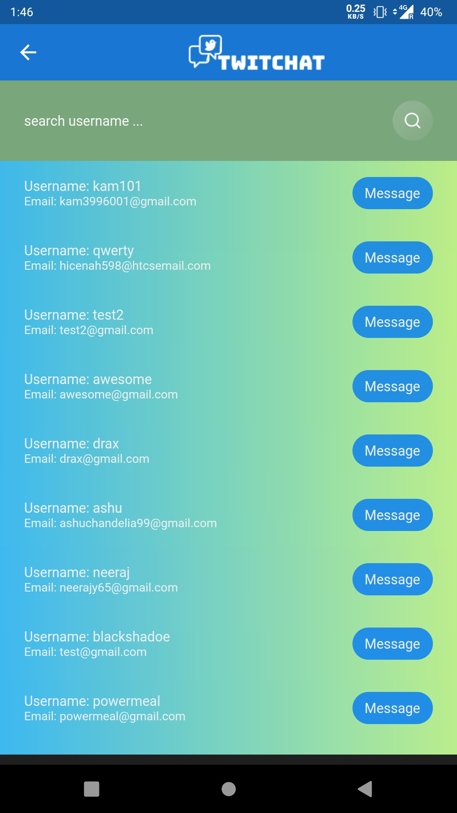
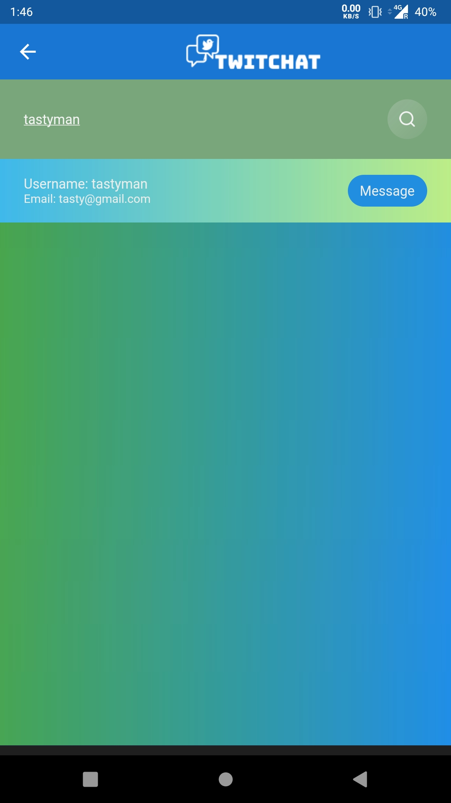
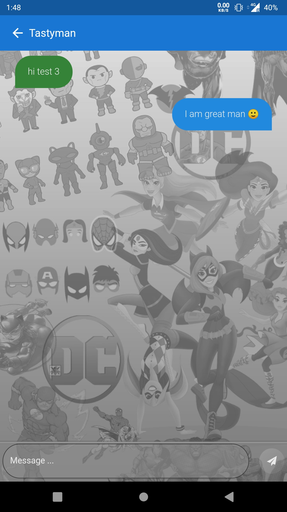
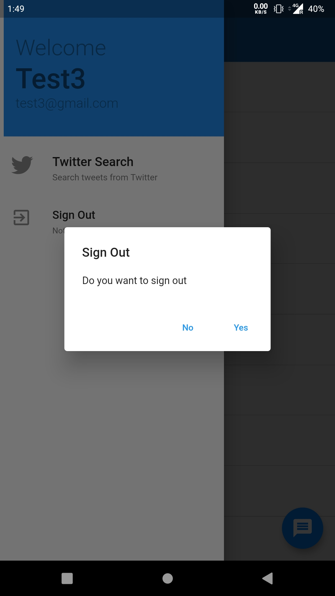
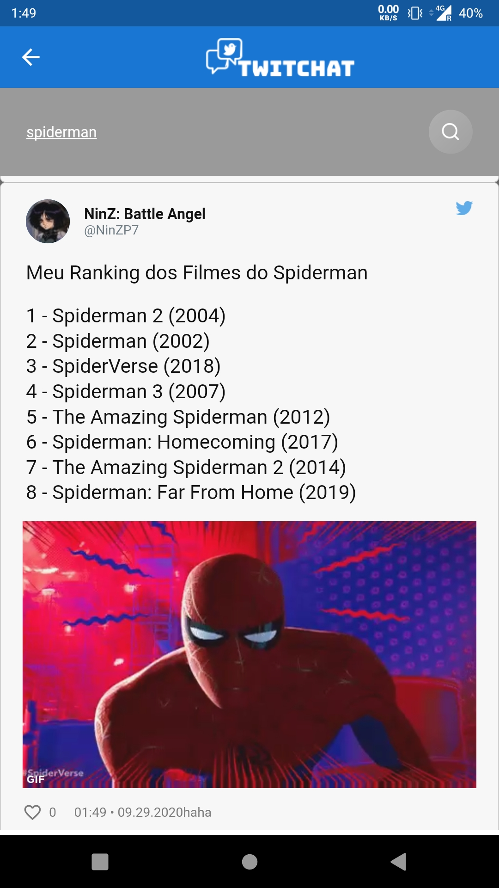

A chat application made with Flutter with the Twitter Search functionality included with it.
The Complete application is made from scratch (excluding twitter search part which uses 2 API's).

## Features
1. Authentication Using firebase authentication.
2. Storing user info, user chats and chatroom details in the Cloud Firestore.
3. Searching user info from the Users list from the database using Firestore queries.
4. Storing user info in the local device to keep him logged in even after closing the application using shared preferences.
5. Twitter mixed( popular + recent ) search showing 20 results (can be changed), Using Twitter API and Twitter view API.

## How To Run
### Requirements

```sh
 flutter
 android studio
 ```

After installing the Requirements stated above...
In Flutter console or android studio use this command to get application dependencies.

```sh
flutter: $ pub get
android studio: $ flutter pub get
```
### Note
> _1._  Do not make changes with the database file as changing it may cause errors with server communication.

>  _2._ Application won't work in ios devices as ios app connection to firestore requires mac and I only have windows currently. (can be done in a mac machine in 10 minutes.)

## How To Use

### Demo Files
- App
[app](./demoapp.apk)

- Video 
[video](./demo.mp4)

### Screenshots Demo

- You can either **Sign Up** or use your existing id for **Signing In**.
<p align="left">

 
</p>

- After authentication you will reach **Chatroom** where you can search for users using **Message Floating Button** or use **Drawer** for other features such as **Twitter Search**.
<p align="left">

 
 </p>
 
 - If you did'nt search anything **All Users** on the app will appear, you can search for a particular **User** using his **Username**.
 <p align="left">
 
 
 </p>
 
 - From the **Chatroom** you can go to particular **Chatscreen** by tapping any of the the chats.
 <p align="left">
 

- From the **Drawer** you can **Sign Out** of the app or use **Twitter Search** function which will show you 20 **mixed(popular+recent)** for the search query.
<p align="left">
 
 
</p>

## Timeline
A Detailed as well as overview timeline is included.

### Overview
| Duration | Task |
| ------ | ------- |
| **18th Sept - 19th Sept** | Installation and learning about Flutter basics. |
| **20th Sept - 21st Sept** | Building UI and functions for authentication. |
| **22th Sept - 23rd Sept** | Setting and communicating with the database. |
| **24th Sept - 25th Sept** | Building and setting the rest of UI and its functionality. |
|  **20th Sept - 21st Sept** | Twitter Search Implementaion. |
### Detailed
- **18th Sept -**  Installation of Flutter and android studio
- **19th Sept -**  Learning the basic Flutter applications from Flutter official website.
- **20th Sept -** Implementing UI of the Sign In & Sign Out and connecting app through Firebase.
- **21st Sept -** Implementing SignIn and SignOut functions and connecting application to google firebase authentication.
- **22nd Sept -** Connecting application through Firestore database and saving user data to the database.
- **23rd Sept -** Implementing Search using username UI and functioning to search user data from Firestore database.
- **24th Sept -** Implementing chatroom UI and addmessage() to database as well as getmessages() from database function.
- **25th Sept -** Creating chat screen for each conversation. Also various UI changes in the app including drawer, wallpaper, loading screens. A lot of testing.
- **26th Sept -** Studying about Twitter API and getting search results in JSON data format.
- **27th Sept -** Adding search tweets screen and converting the JSON data to this format using tweet_ui API. 
- **28th Sept -** Documentation you are reading right now, Demo video and screenshots of the app.

## Difficulties
As I didn't have any experience with making an application before, I have to lookup everything on the internet and so whole process was a little time-consuming but also rewarding which made me faster with time.

**Major problems/errors faced**
- Render flex errors.
- Null value errors.
- Data abstraction from the database errors.
- Positioning of layers in order. (like containers overlapping each other and height, width, padding issues)
- Conversion of twitter data to twitter view.

**Things which could be better**
- In a chatapp the number of features that can be added is endless and I still feel many features can still be added to the app like ( message deletion , chat screen wallpapers change, settings pane, notification functionality).
- There is still scope for UI improvements.
- Many problems which are solved and some unsolved which arrived after testing.
- Not much time spent on the twitter search function as lack of information with Twitter API and flutter combination on the internet and is also hard to understand.
- ios functionality as I don't have an Apple device and windows is unable to open ios files. (Blame Apple)

## Conclusion
This project helped me in learning a lot about flutter and android application development.
I really enjoyed the process and hope to continue my career in this path in the future.
I hope you enjoy the application. I have included a final built android application and a demo video with the project. 


